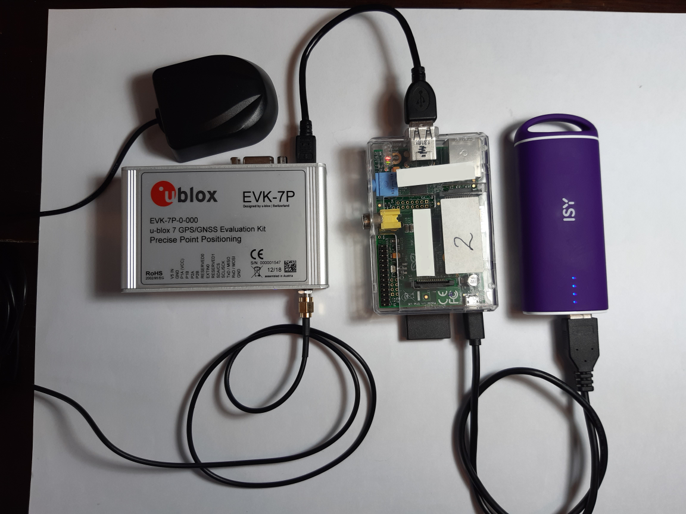

# ublox GNSS Monitor

## Summary

C code to access a ublox EVK-7P and log position data.
It contains a partial implementation of the UBX protocol
because of number of the more advanced configruation options
are not available through the NMEA protocol.

## Use Case

I have used this code to perform some measurements on the accuracy of GPS
under various conditions.  For this I used to ublox EVK-7P GPS/GNSS Evaluation
kit (GNSS receiver).  Ublox provides software to read data from the GNSS
receiver however this runs under Windows.  Did not like carrying a laptop
around so I started looking for a smaller solution.

This resulted in the following setup:

It consists of a RaspberryPi running custom software to configure the reciever
and to log the position data from the GNSS receiver.  The GPS reciever and
powerbank to power both the RaspberryPi and GNSS receiver.

Everything is started when power is applied to the RaspberryPi. After this
the following happens:

1. The Pi boots and automatically starts the monitor program.
2. The monitor program will run for an hour and store the results in a log
   file.
3. After this the RaspberryPi will automatically shutdown so the power can be
   removed safely.

## Installation

On the RaspberryPi, under the pi account create a directory `GNSS`.
Then copy everything from the `src` directory from this repository to this
directory. Run

    make

This should create the executable `mon`.

To be able to automallically start the monitor program when the Pi
is started up add the following line to the crontab of root

    @reboot /home/pi/GNSS/start_experiment.sh

using

    sudo su
    crontab -e

